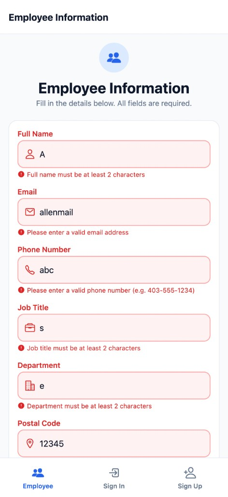
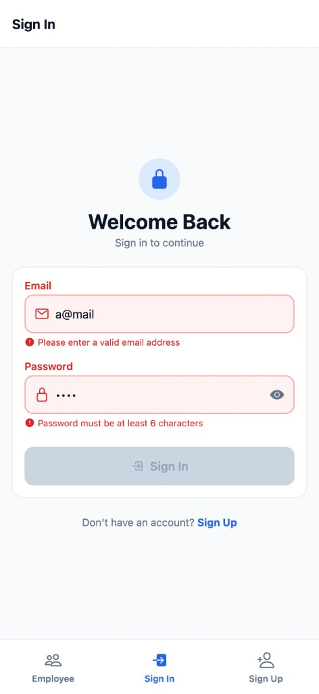
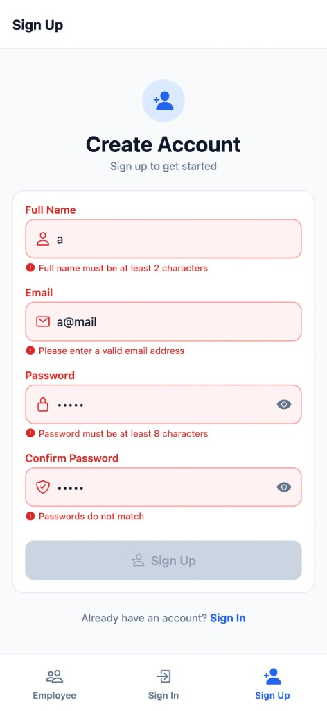

# Assignment: Advanced Form Development and Validation with React Hook Form & Zod (Expo)

This project demonstrates **schema-based validation with Zod** and **form state management with React Hook Form** in an Expo TypeScript application.

---

## React Hook Form + Zod

Validation logic is separated from the UI. Every form follows this pattern:

```
Zod Schema (src/schemas/)  →  zodResolver  →  useForm  →  CustomInput (Controller)  →  Error messages on screen
```

**1. Validation rules defined in Zod schemas** (`src/schemas/`)

```ts
export const employeeSchema = z.object({
  email: z.email('Please enter a valid email address').min(1, 'Email is required'),
  phone: z.string().min(1, 'Phone number is required').regex(PHONE_REGEX, '...'),
});
```

**2. Schema connected to React Hook Form via `zodResolver`**

```ts
const { control, handleSubmit, formState: { isValid } } = useForm<EmployeeFormData>({
  resolver: zodResolver(employeeSchema),
  mode: 'onChange',
});
```

**3. Fields bound to inputs through `Controller` in `CustomInput`**, which displays `fieldState.error.message` when validation fails.

**4. Submission blocked until valid:** `disabled={!isValid}` on the submit button.

---

## Screenshots — Validation in Action

Zod validation errors display in real time (`mode: 'onChange'`). Invalid fields show red labels, borders, backgrounds, and the exact error message below each input.

### Employee Information Form



| Input entered | Zod rule triggered | Error message shown |
|---|---|---|
| `A` in Full Name | `.min(2)` | "Full name must be at least 2 characters" |
| `allenmail` in Email | `z.email()` | "Please enter a valid email address" |
| `abc` in Phone | `.regex(PHONE_REGEX)` | "Please enter a valid phone number (e.g. 403-555-1234)" |
| `s` in Job Title | `.min(2)` | "Job title must be at least 2 characters" |
| `e` in Department | `.min(2)` | "Department must be at least 2 characters" |
| `12345` in Postal Code | `.regex(POSTAL_CODE_REGEX)` | Canadian postal code format error |

`src/schemas/employeeSchema.ts` · `src/screens/EmployeeScreen.tsx`

### Sign-In Form



| Input entered | Zod rule triggered | Error message shown |
|---|---|---|
| `a@mail` in Email | `z.email()` | "Please enter a valid email address" |
| `••••` (4 chars) in Password | `.min(6)` | "Password must be at least 6 characters" |

`src/schemas/signInSchema.ts` · `src/screens/SignInScreen.tsx`

### Sign-Up Form



| Input entered | Zod rule triggered | Error message shown |
|---|---|---|
| `a` in Full Name | `.min(2)` | "Full name must be at least 2 characters" |
| `a@mail` in Email | `z.email()` | "Please enter a valid email address" |
| `•••••` (5 chars) in Password | `.min(8)` | "Password must be at least 8 characters" |
| `•••••` in Confirm Password | `.refine()` password match | "Passwords do not match" |

`src/schemas/signUpSchema.ts` · `src/screens/SignUpScreen.tsx`

---

## Completed Requirements

### 1. Project Setup
- Expo TypeScript template
- `react-hook-form`, `zod`, `@hookform/resolvers` installed
- Folder structure: `src/components`, `src/schemas`, `src/screens`, `src/theme`, `src/types`
- Validation schemas separated from UI in `src/schemas/`

### 2. Employee Information Form
- 6 input fields (full name, email, phone, job title, department, postal code)
- React Hook Form state management with `zodResolver`
- Format validation (email, phone, postal code), required fields, min/max length
- Real-time validation (`onChange` mode)
- Clear error messages below each field
- Submit button disabled until form is valid

### 3. Authentication Forms

**Sign In** — email and password with valid email format, required fields, and minimum password length.

**Sign Up** — full name, email, password, and confirm password with minimum length, password strength rules (uppercase, lowercase, number, special character), and confirm password matching via Zod `.refine()`.

Both forms disable submission while validation errors are present.

### 4. Navigation & Screen Structure
- Three separate screens with tab navigation via Expo Router

| Screen | Route | File |
|---|---|---|
| Employee Information | `/` | `app/index.tsx` |
| Sign In | `/sign-in` | `app/sign-in.tsx` |
| Sign Up | `/sign-up` | `app/sign-up.tsx` |

### 5. Styling & User Experience
- Input focus styling (blue border + tinted background)
- Error styling (red label, border, background, inline message with icon)
- Button enabled/disabled/loading states
- Icons on inputs, buttons, and tab bar

---

## Key Files

| Purpose | File |
|---|---|
| Employee Zod schema | `src/schemas/employeeSchema.ts` |
| Sign In Zod schema | `src/schemas/signInSchema.ts` |
| Sign Up Zod schema | `src/schemas/signUpSchema.ts` |
| RHF-connected input | `src/components/CustomInput.tsx` |
| Employee screen | `src/screens/EmployeeScreen.tsx` |
| Sign In screen | `src/screens/SignInScreen.tsx` |
| Sign Up screen | `src/screens/SignUpScreen.tsx` |

---

## How to Run

```bash
npm install
npx expo start
```

Press `i` for iOS, `a` for Android, or `w` for web.

---

## Submitted by

Allen John — 000961216
